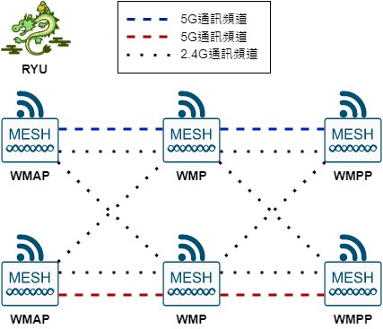
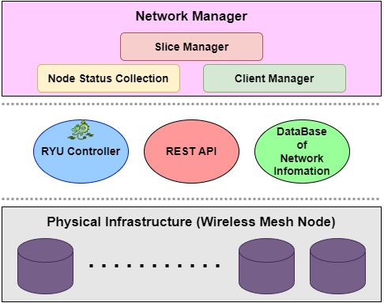
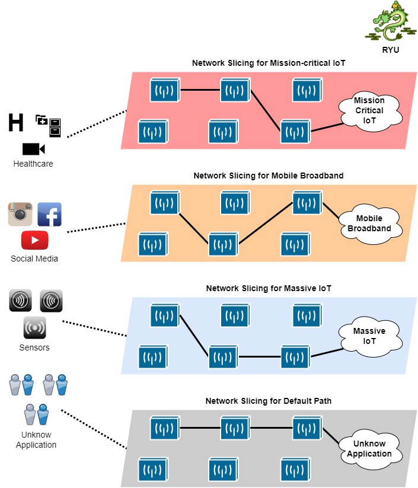
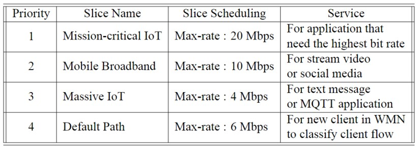

# NSDAR-SDN-Project
以SDN為基底的WMN網路架構下提供物聯網設備無線連線使用，利用VLAN以及QoS保證其連線狀況，物聯網設會透過WMAP連上網路，並且會根據本文設計的路由演算法，將物聯網產生的網路流路由至WMPP並且提供網際網路的服務，SDN控制器會提供點對點的網路切片，分別給物聯網設備上不同的網路應用使用。

## 程式介紹

### python 環境

- Python version : 3.6.13  
- Python Packge :  
  - paho-mqtt : 1.6.1 -- mqtt服務  
  - Paramiko : 2.8.1 -- ssh服務  
  - PyQt5 : 5.15.4 -- UI介面服務以及所有連動程式  
  - pyshark : 0.4.3 -- Wireshark服務  
  - requests : 2.26.0 -- REST API服務  
  - ryu : 4.34 -- SDN controller  

### 功能介紹

- [[main.py](main.py)] :   
  - 主程式執行檔，會呼叫UI介面，並且打開ryu控制器的功能。  
- [[workwidget](workwidget)] :   
  - UI介面以及牽動所有服務。
- [[sdn_controller](sdn_controller)] :   
  - ryu控制器執行檔以及其相關功能。
- [[node_info](node_info)] :   
  - 網路環境資訊收集。  
- [[get_user](get_user)] :   
  - 使用者控制，針對連線使用者進行相對應動作。  
- [[path_calculate](path_calculate)] :   
  - 路由路徑計算。
- [[DBControll](DBControll)] :  
  - 資料庫，儲存網路環境上的相關資料。  
- [[ssh](ssh)] :   
  - ssh服務。

## 實驗介紹

### 實驗網路架構

**網路架構說明**

- SDN控制器 : RYU Controller  
- 節點組成 : 兩個樹梅派連接--結合OLSR以及OVS  
- 使用Wi-Fi頻段 : 2.4GHz以及5GHz  

### 實驗控制器架構

**控制器架構說明**

- Slice Manager： [[path_calculate](path_calculate)]   
  - 創建、管理網路切片，分配網路資源。  
- Node Status Collection： [[node_info](node_info)]  
  - 收集、紀錄網路節點上各種資訊。  
- Client Manager： [[get_user](get_user)]
  - 管理網路中的客戶端，為客戶端使用的不同網路流分配網路切片。  

### NSDAR-SDN演算法說明

**網路切片路由方法介紹**  

- 網路切片創建  
  - 保證不同網路服務之QoS  
- 網路切片路由路徑選擇依據  
  - ETT總和最小之路徑優先  
  - 鏈路頻寬符合網路應用優先  
- 以網路流應用為導向分配網路切片  
  - 相同應用有相同路由路徑  
  - 避免重複制定一樣的路由規則  

### 網路切片設計

**網路切片設計說明**
- Mission-critical IoT  
  - 在網路環境裡享有20Mbps的頻寬。  
- Mobile Broadband  
  - 在網路環境裡享有10Mbps的頻寬。  
- Massive IoT  
  - 在網路環境裡享有4Mbps的頻寬。  
- Default Path  
  - 在客戶端進入網路環境時，給予客戶連線上網的預設路由路徑，並且在控制器辨認其網路流應用後，將不同應用的網路流分配到不同的網路切片。  
